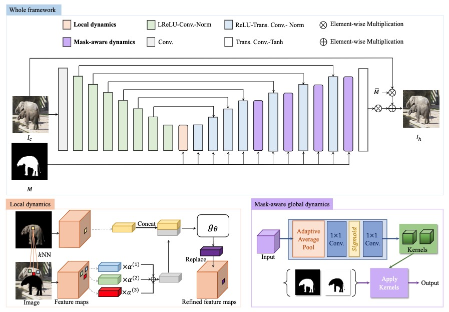
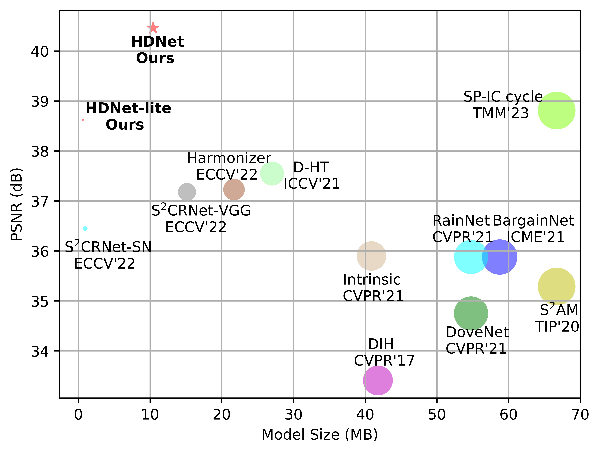
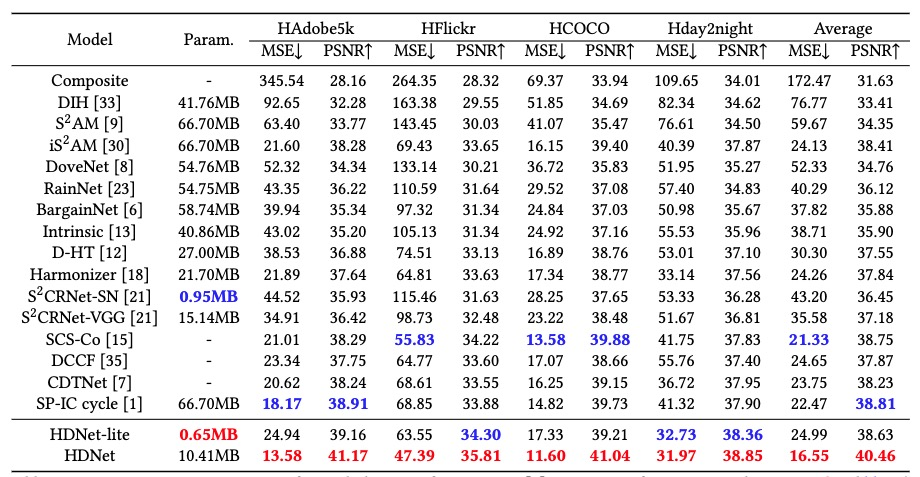

## Hierarchical Dynamic Image Harmonization

[](https://paperswithcode.com/sota/image-harmonization-on-iharmony4?p=hierarchical-dynamic-image-harmonization)

[](https://paperswithcode.com/sota/image-harmonization-on-hadobe5k-1024-times?p=hierarchical-dynamic-image-harmonization)


This is the official code of the paper: Hierarchical Dynamic Image Harmonization.

> [**Hierarchical Dynamic Image Harmonization**](https://arxiv.org/abs/2211.08639)               
> [Haoxing Chen](https://scholar.google.com/citations?hl=zh-CN&pli=1&user=BnS7HzAAAAAJ), [Zhangxuan Gu](https://scholar.google.com/citations?user=Wkp3s68AAAAJ&hl=zh-CN&oi=ao), [Yaohui Li](https://scholar.google.com/citations?user=pC2kmQoAAAAJ&hl=zh-CN), Jun Lan, Changhua Meng, [Weiqiang Wang](https://scholar.google.com/citations?hl=zh-CN&user=yZ5iffAAAAAJ), [Huaxiong Li](https://scholar.google.com/citations?user=AC-EDw0AAAAJ&hl=zh-CN) 
> *[arXiv 2211.08639](https://arxiv.org/abs/2211.08639)*  

## Preparation
### 1. Clone this repo:
```bash
git clone https://github.com/chenhaoxing/HDNet
cd HDNet
```

### 2. Requirements
* Both Linux and Windows are supported, but Linux is recommended for compatibility reasons.
* We have tested on PyTorch 1.8.1+cu11. 

install the required packages using pip: 
```bash
pip3 install -r requirements.txt
```
or conda:
```bash
conda create -n rainnet python=3.8
conda activate rainnet
pip install -r requirements.txt
```
### 3. Prepare the data
Download [iHarmony4](https://github.com/bcmi/Image-Harmonization-Dataset-iHarmony4) dataset in dataset folder and run  `data/preprocess_iharmony4.py` to resize the images (eg, 512x512, or 256x256) and save the resized images in your local device. 

### Training and validation
We provide the code in train_evaluate.py, which supports the model training, evaluation and results saving in iHarmony4 dataset.
```python
python train_evaluate.py --dataset_root <DATA_DIR> --save_dir results --batch_size 12 --device cuda 
```

## Results




## Citing HDNet
If you use HDNet in your research, please use the following BibTeX entry.

```BibTeX
@article{HDNet,
      title={Hierarchical Dynamic Image Harmonization},
      author={Chen, Haoxing and Gu, Zhangxuan and Yaohui Li and Lan, Jun and Meng, Changhua and Wang, Weiqiang and Li, Huaxiong},
      journal={arXiv preprint arXiv: 2211.08639},
      year={2022}
}
```


## Acknowledgement
Many thanks to the nice work of  [RainNet](https://github.com/junleen/RainNet). Our codes and configs follow [RainNet](https://github.com/junleen/RainNet).

## Contacts
Please feel free to contact us if you have any problems.

Email: [haoxingchen@smail.nju.edu.cn](haoxingchen@smail.nju.edu.cn) or [hx.chen@hotmail.com](chen@hotmail.com)
